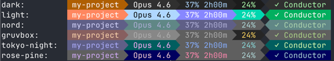

# conductor-powerline

[](https://github.com/rbarcante/conductor-powerline/actions/workflows/ci.yml) [](https://github.com/rbarcante/conductor-powerline/releases/latest)

A fast, zero-dependency Go CLI that renders a powerline-style statusline for [Claude Code](https://docs.anthropic.com/en/docs/claude-code).

- Model info, git branch, directory, API usage (5h block / 7d rolling), context window
- **Second line**: live Conductor workflow status (setup, active track, task progress, overall tracks)
- 6 built-in themes — dark, light, nord, gruvbox, tokyo-night, rose-pine
- Nerd Font glyphs (with plain-text fallback)
- macOS Keychain, Linux secret-tool, Windows Credential Manager
- Silent failure — never crashes or pollutes your shell

## Themes



## Prerequisites

- **Go 1.25+** — `brew install go` (macOS) · `sudo apt install golang` (Debian/Ubuntu) · `sudo pacman -S go` (Arch/Manjaro) · [go.dev/dl](https://go.dev/dl/)
- **Claude Code** — the statusline hooks into its [statusLine setting](https://docs.anthropic.com/en/docs/claude-code)
- **Nerd Font** *(optional)* — falls back to plain text · [nerdfonts.com](https://www.nerdfonts.com/)

## Quick start

Add to `~/.claude/settings.json`:

```json
{
  "statusLine": {
    "type": "command",
    "command": "go run github.com/rbarcante/conductor-powerline@latest"
  }
}
```

That's it — restart Claude Code and the powerline appears in your statusline.

## Segments

| Segment | Description |
|---------|-------------|
| `directory` | Current project/directory name |
| `git` | Branch name with dirty-state indicator |
| `model` | Active Claude model (Opus, Sonnet, Haiku) |
| `block` | 5-hour block usage percentage and time remaining |
| `weekly` | 7-day rolling usage percentage |
| `context` | Context window usage with threshold colors |
| `conductor` | Conductor plugin status / "Try Conductor" hyperlink |

### Second Line — Conductor Workflow Status

When the [Conductor plugin](https://github.com/rbarcante/claude-conductor) is active in the current project, a second powerline line appears automatically with four segments:

| Segment | Key | Example | Description |
|---------|-----|---------|-------------|
| Setup status | `workflow_setup` | `Setup 100%` | Conductor project setup completion |
| Active track | `workflow_track` | `auth-flow` | Name/ID of the current in-progress track |
| Track tasks | `workflow_tasks` | `12/35` | Completed / total tasks for the active track |
| Overall tracks | `workflow_overall` | `9/9 tracks` | Completed / total tracks across the project |

Line 2 is rendered only when **all** conditions are met:
- Conductor plugin is installed and the project has a `conductor/` directory
- `conductor_cli.py --json status` succeeds (exit 0, valid JSON)
- `conductor_workflow` segment is enabled in config (default: `true`)

To disable line 2:
```json
{ "segments": { "conductor_workflow": { "enabled": false } } }
```

## Configuration

Loaded in order (later overrides earlier):

1. Built-in defaults
2. User config: `~/.claude/conductor-powerline.json`
3. Project config: `./.conductor-powerline.json`

```json
{
  "theme": "nord",
  "display": {
    "nerdFonts": true,
    "compactWidth": 100
  },
  "segments": {
    "directory": { "enabled": true },
    "git": { "enabled": true },
    "model": { "enabled": true },
    "block": { "enabled": true },
    "weekly": { "enabled": false },
    "context": { "enabled": true },
    "conductor": { "enabled": true },
    "conductor_workflow": { "enabled": true }
  },
  "segmentOrder": ["directory", "git", "model", "block", "weekly", "context", "conductor", "conductor_workflow"],
  "apiTimeout": "5s",
  "cacheTTL": "30s",
  "trendThreshold": 2.0
}
```

| Field | Type | Default | Description |
|-------|------|---------|-------------|
| `theme` | string | `"dark"` | Color theme name |
| `display.nerdFonts` | bool | `true` | Use Nerd Font glyphs |
| `display.compactWidth` | int | `100` | Truncate segments when total width exceeds this |
| `segments.<name>.enabled` | bool | `true` | Enable/disable individual segments |
| `segmentOrder` | []string | *(all)* | Order of segments left-to-right |
| `apiTimeout` | duration | `"5s"` | HTTP timeout for usage API |
| `cacheTTL` | duration | `"30s"` | Cache lifetime for API responses |
| `trendThreshold` | float | `2.0` | Percentage change threshold for trend arrows |

## tmux

Works inside tmux. For OSC 8 hyperlink support (tmux 3.1+), add to `.tmux.conf`:

```
set -as terminal-features ",*:hyperlinks"
```

> **Note:** Hyperlinks in the conductor segment are not clickable inside tmux due to a [Claude Code limitation](https://github.com/anthropics/claude-code/issues/27047). The URL is shown as plain text instead.

## Development

```bash
make test          # Run all tests
make test-coverage # Generate HTML coverage report
make lint          # Run golangci-lint
make fmt           # Format code
make vet           # Run go vet
```

Or build from source:

```bash
git clone https://github.com/rbarcante/conductor-powerline.git
cd conductor-powerline
make build
```

## License

[MIT](LICENSE)
